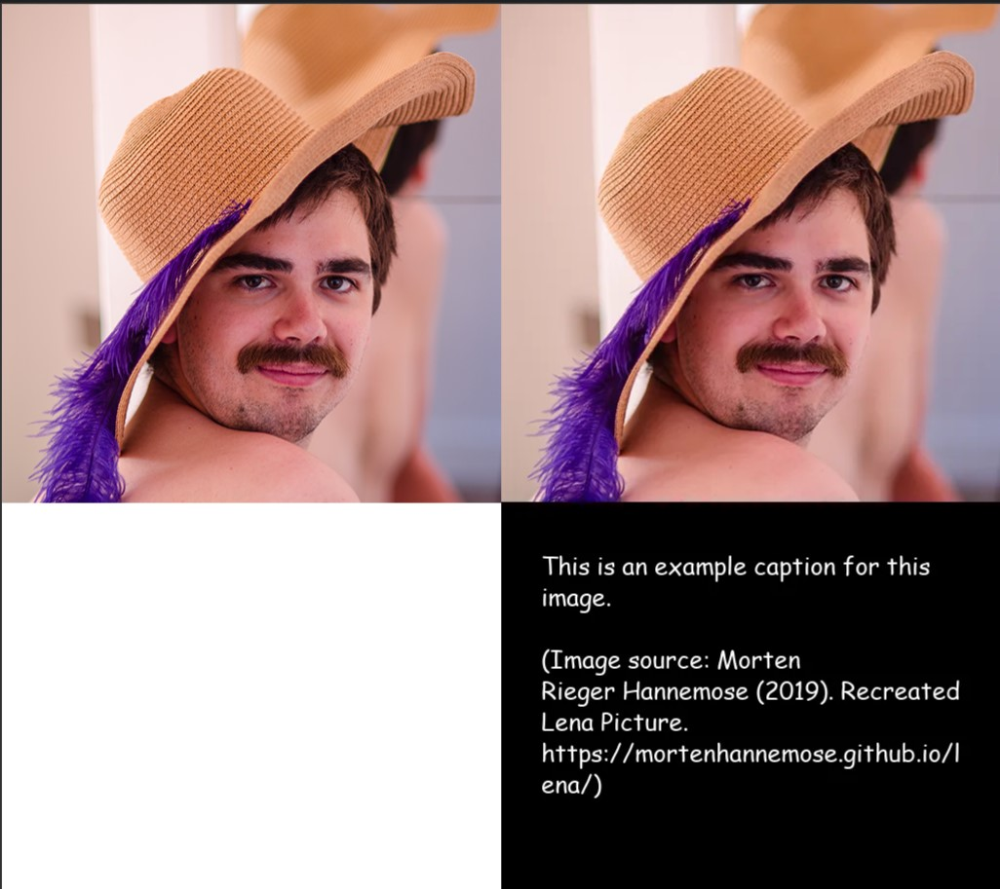

# caption-adder



Adds a caption to the bottom of an image based on a text file.


## Installation

First, git clone the repository, or download it. Ensure you have Python 3 installed.

Next, install the dependencies:
```commandline
pip install -r requirements.txt
```

## Usage
```commandline
python3 caption_adder.py [-h] [-o OUT] [-f] [-S SIZE] [-F FONT] [-P PADDING] imagefile captionfile
```

**Positional Arguments**:
- `imagefile`: Filepath of the image to add the caption to
- `captionfile`: Filepath of the text file of the caption.

**Options**:
- `-h, --help`: Show help message
- `-o OUT`, `--out OUT`: `OUT` is the filepath for the output file. If not provided, the default is the name of the input image file with `_cap` added at the end.
- `-f`, `--force`: Overwrites the output file if the file already exists.
- `-S SIZE`, `--size SIZE`: `SIZE` is the size of your caption font. If not provided, the default is `100`.
- `-F FONT`, `--font FONT`: `FONT` is the **full name** of your caption font (e.g. `"Comic Sans MS"`, `"Arial"`). If not provided, the default is `"Arial"`.
- `-P PADDING`, `--padding PADDING`: `PADDING` is the amount of space surrounding the caption text. If not provided, the default is `75`.

You can recreate the above image on the right with the following command:
```commandline
python3 caption_adder.py -S 25 -F "Comic Sans MS" ./example/example_orig.webp ./example/example_orig.txt
```

## Quick Troubleshooting

### `ModuleNotFoundError`
Please install the dependencies with:
```commandline
pip install -r requirements.txt
```

### Could not open requirements file: No such file or directory
Ensure you are in the project directory `caption-adder`. 

### I can't run Python 3!
If you're on Windows, try `py` instead.

Otherwise, this is probably an issue with your setup of Python -- do check your system path for Python.

### I can't use a font that is installed on my computer!
Please ensure you enter the **full name** of the font and put it in quotes.
- For instance, `"Comic Sans"` would fail, `"Comic Sans MS"` wouldn't.
- Otherwise, do open an issue with the font file that's failing -- I can't say for sure what the issue is since I'm relying on MatPlotLib's Font Manager module.

### The caption doesn't fit on screen
That's a bug, please report it.